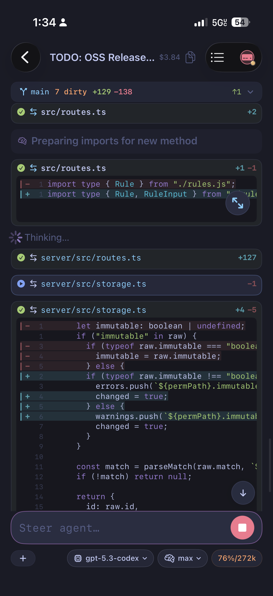
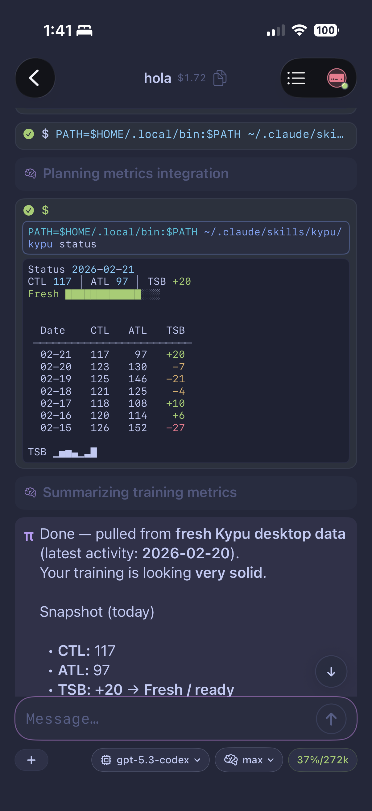
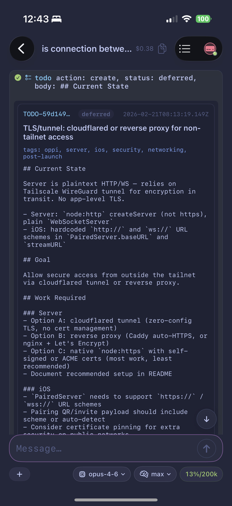

# Demo Screenshots

These examples show how tool output is rendered in Oppi chat.

## Demo video

https://github.com/user-attachments/assets/<uuid>

## Streaming diffs with syntax highlighting

## ANSI terminal output

## Extension rendering

