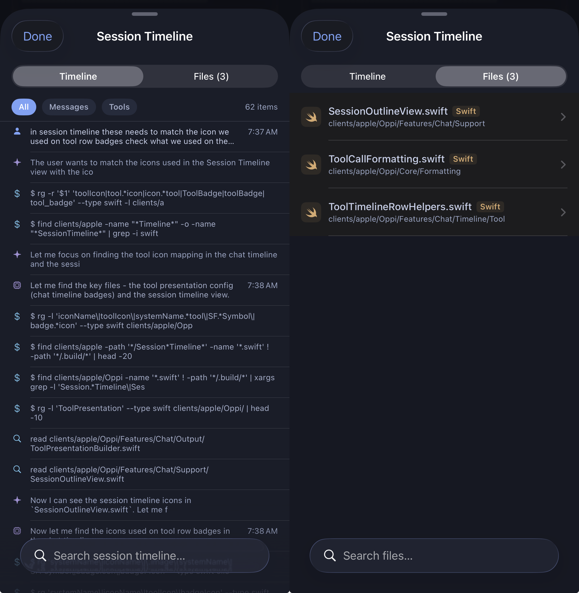
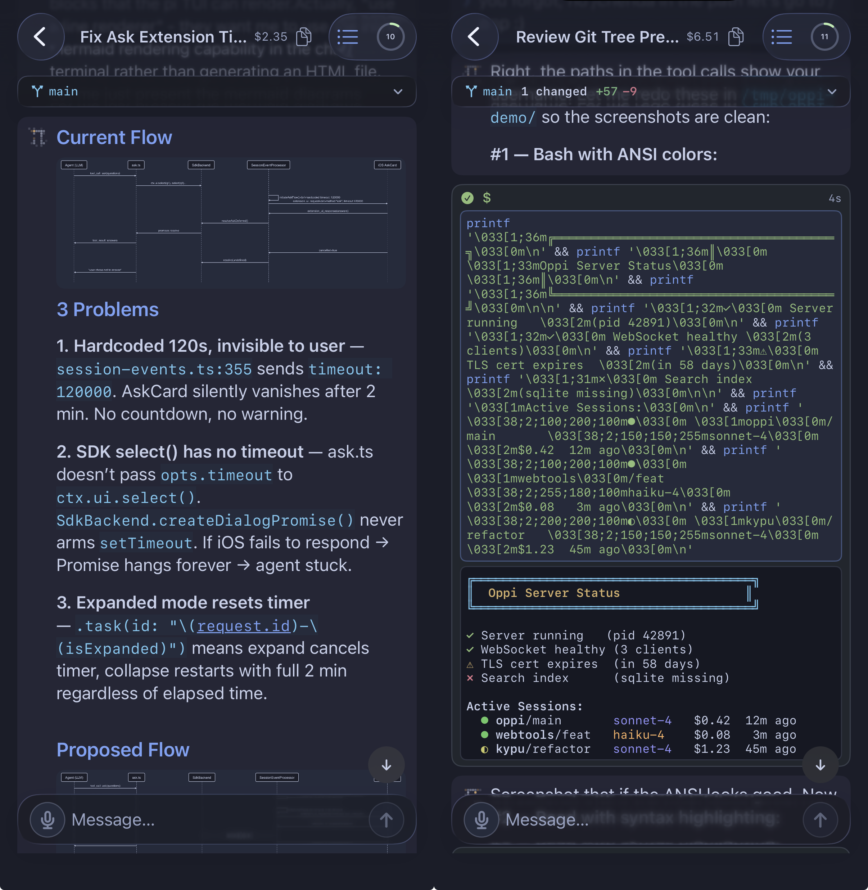
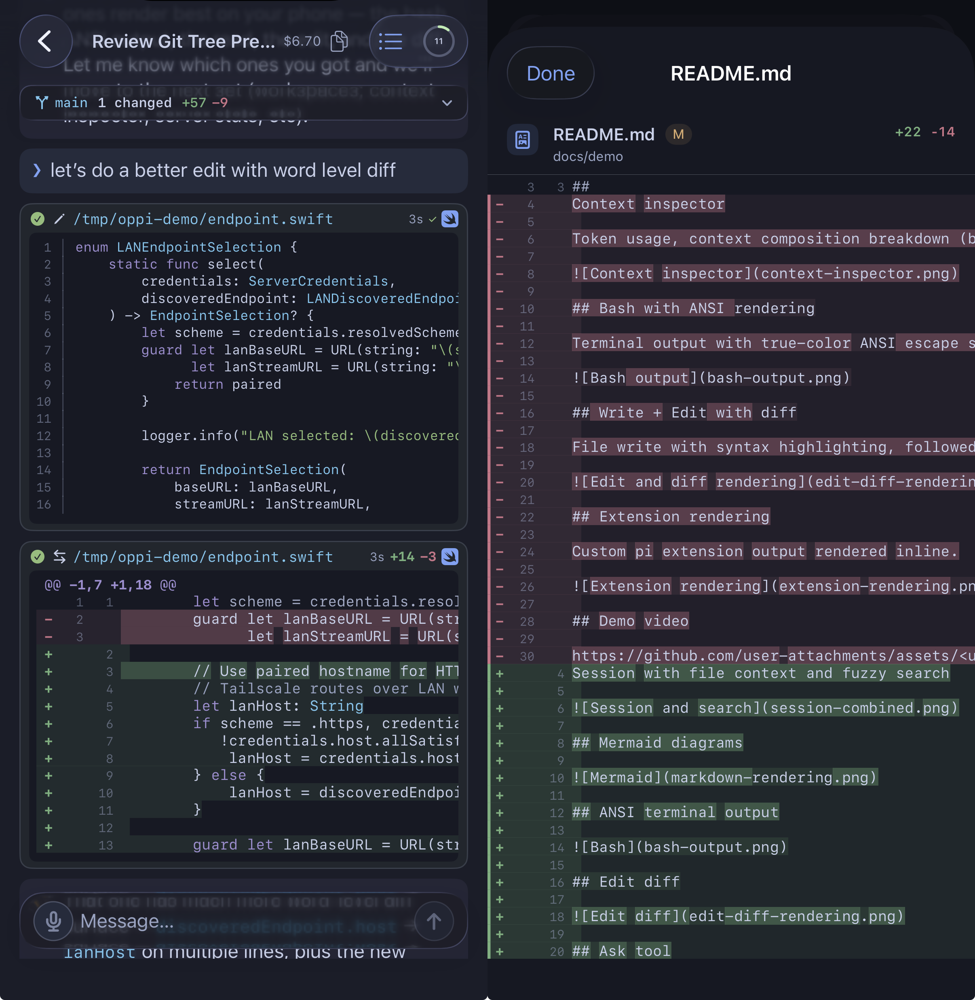
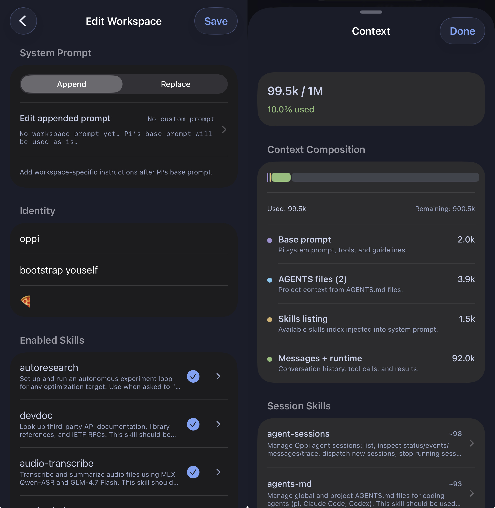
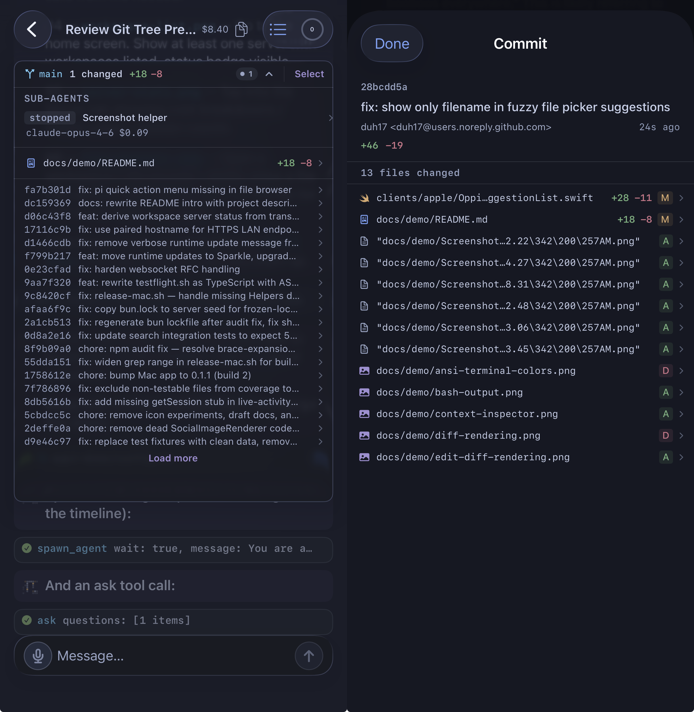

# Screenshots

## Session with file context and fuzzy search

## Session timeline and files

## Markdown with Mermaid and ANSI terminal output

## Edit and file diff

## Ask tool

## Workspace editor and context inspector

## Permission gate and safety rules

## Git context bar and commit detail

## HTML and markdown rendering

