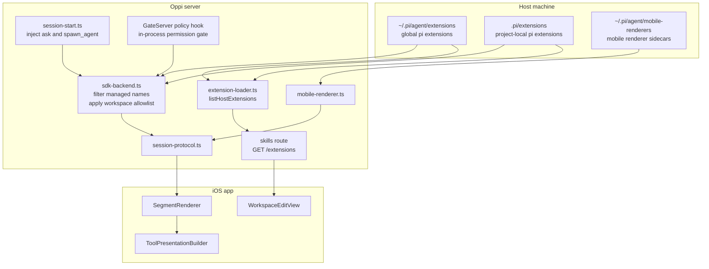

# Oppi extension behavior

This page only covers what Oppi changes or adds on top of pi's extension system.

For writing extensions, supported layouts, lifecycle hooks, tool APIs, and TUI renderers, use pi's docs:

- pi extension docs: `server/node_modules/@mariozechner/pi-coding-agent/docs/extensions.md`
- pi examples: `server/node_modules/@mariozechner/pi-coding-agent/examples/extensions/`

## What Oppi changes

Oppi adds three behaviors on top of normal pi extension loading:

1. **Server-managed first-party tools**
   - `ask`
   - `spawn_agent`
   - `permission-gate` as a reserved managed name
2. **Workspace allowlist filtering** via `workspace.extensions`
3. **Mobile rendering** via server-side `StyledSegment[]`, not pi TUI components

## Architecture

## Runtime behavior

### Host extensions

At session startup, Oppi starts from pi's normal discovered extension set for the session cwd:

- `~/.pi/agent/extensions/`
- `.pi/extensions/`

Oppi does not replace that mechanism. It filters it.

### Managed names

Oppi reserves these names:

- `permission-gate`
- `ask`
- `spawn_agent`

Those names are filtered out of host discovery and owned by the server.

- `ask` comes from `server/extensions/ask.ts`
- `spawn_agent` comes from `server/extensions/spawn-agent.ts`
- `permission-gate` is implemented by the server policy engine in `server/src/sdk-backend.ts`

### Workspace allowlist

`workspace.extensions` has two modes:

- **`undefined`**: use pi's normal discovery, plus Oppi first-party tools
- **defined**: treat the list as an authoritative allowlist for optional extensions

If a workspace sets `extensions`, include `ask` and `spawn_agent` explicitly if you want to keep them.

## Extension picker behavior

`GET /extensions` is not a generic pi reference API. It is the picker source for the Oppi workspace editor.

Behavior:

- always scans `~/.pi/agent/extensions/`
- also scans `<workspace cwd>/.pi/extensions/` when the client provides a cwd
- excludes managed names
- deduplicates by extension name for UI display
- prefers the project-local entry when the same name exists in both places

That last rule is a UI choice so the picker matches the workspace context cleanly.

## Mobile rendering gotcha

Pi's `renderCall()` and `renderResult()` drive the terminal UI. Oppi iOS does not use them.

For mobile, Oppi uses server-side renderers that produce `StyledSegment[]`.

Sources:

- built-in renderers in `server/src/mobile-renderer.ts`
- optional sidecars in `~/.pi/agent/mobile-renderers/*.ts`

If an extension looks good in terminal pi but looks generic in Oppi, this is usually why.

## Permission gate gotcha

`permission-gate` is not a host extension you install or toggle per workspace.

Oppi replaces that behavior with an in-process gate wired through the server and mobile approval flow.

## File map

| File | Why it matters |
|---|---|
| `server/extensions/first-party.ts` | Reserved names and enablement rules |
| `server/extensions/ask.ts` | First-party ask tool |
| `server/extensions/spawn-agent.ts` | First-party multi-agent tools |
| `server/src/extension-loader.ts` | Picker discovery for global + project-local extensions |
| `server/src/routes/skills.ts` | `GET /extensions` |
| `server/src/session-start.ts` | Injects first-party factories |
| `server/src/sdk-backend.ts` | Filters managed names and applies workspace allowlist |
| `server/src/mobile-renderer.ts` | Mobile tool row renderers |
| `server/src/session-protocol.ts` | Sends `callSegments` and `resultSegments` to iOS |

## When to read pi docs instead

Go to pi's docs for:

- how to write an extension
- supported extension directory layouts
- event lifecycle details
- custom tools
- custom commands
- terminal rendering with TUI components
- package-based extension distribution

Use this page for Oppi-specific behavior and gotchas only.
