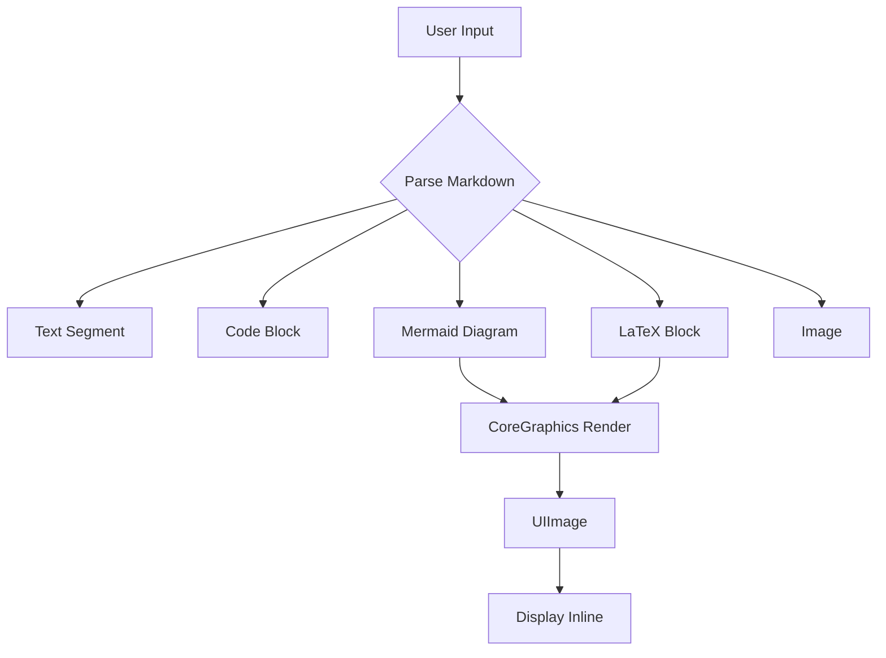
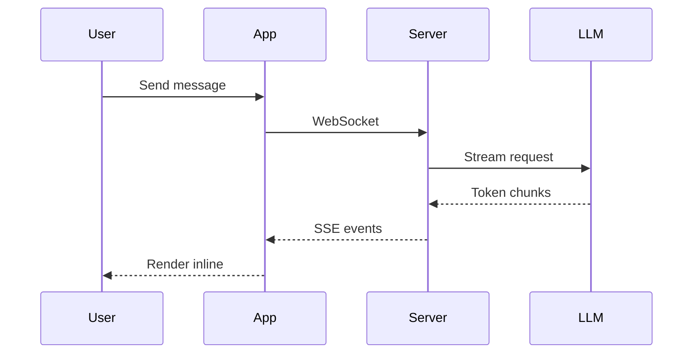
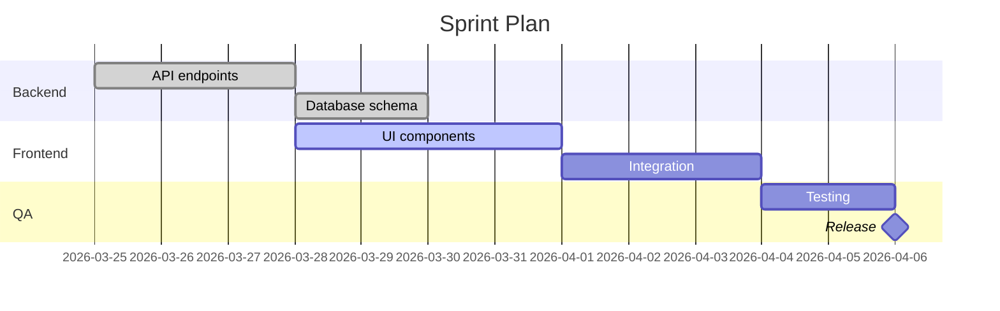

# Oppi Inline Rendering Showcase

Everything below renders natively — no WebViews, no JavaScript, pure CoreGraphics.

---

## Text & Formatting

**Bold**, *italic*, ~~strikethrough~~, `inline code`, and [links](https://example.com).

- Bullet list item
- Another item
  - Nested item

1. Numbered list
2. Second item

> Blockquote: the best code is no code at all.

---

## Code Block (syntax highlighted)

```swift
struct ContentView: View {
    @State private var count = 0
    
    var body: some View {
        Button("Tapped \(count) times") {
            count += 1
        }
    }
}
```

```typescript
async function streamTokens(model: string): Promise<void> {
    const response = await fetch("/api/chat", {
        method: "POST",
        body: JSON.stringify({ model, stream: true }),
    });
    for await (const chunk of response.body!) {
        process.stdout.write(new TextDecoder().decode(chunk));
    }
}
```

---

## Table

| Feature | Status | Notes |
|---------|--------|-------|
| Mermaid flowchart | Done | All directions: TD, LR, BT, RL |
| Mermaid sequence | Done | Participants, async arrows, notes |
| Mermaid gantt | Done | Sections, task states, dependencies |
| Mermaid mindmap | Done | Nested nodes, auto-layout |
| LaTeX math | Done | Block rendering via CoreGraphics |
| Inline images | Done | Remote URLs + workspace relative paths |
| Tables | Done | Headers, alignment, inline formatting |

---

## Mermaid Flowchart



## Mermaid Sequence Diagram



## Mermaid Gantt Chart



## Mermaid Mindmap

```mermaid
mindmap
    root((Rendering))
        Mermaid
            Flowchart
            Sequence
            Gantt
            Mindmap
        LaTeX
            Block formulas
            Symbols
        Images
            Remote URL
            Workspace relative
        Text
            Bold / Italic
            Code spans
            Links
```

---

## LaTeX Math

```latex
\int_0^\infty e^{-x^2} dx = \frac{\sqrt{\pi}}{2}
```

```math
x = \frac{-b \pm \sqrt{b^2 - 4ac}}{2a}
```

```tex
\sum_{n=1}^{\infty} \frac{1}{n^2} = \frac{\pi^2}{6}
```

---

## Remote Image (HTTPS)


## Workspace Relative Image


---

## Horizontal Rule

Above and below this line.

---

*End of showcase. All rendered natively via CoreGraphics — 5-15ms per diagram on a background thread.*
