# Oppi Share & Export System

Oppi renders any AI-generated content natively on iOS and exports it as polished images or PDFs for social sharing. No WebViews in the live chat. No server round-trips for export. Everything runs on-device.

## The Problem

Every app that exports tables, diagrams, or code to images has the same problem: content that scrolls horizontally on screen gets clipped in a static export. We researched how the major apps handle this.

### How Everyone Else Does It

| App | Text Wrap | Font Scale | Wide Table Behavior | Auto Landscape |
|-----|-----------|------------|---------------------|----------------|
| Google Docs | Yes | No | Clips beyond margins | No |
| Microsoft Word | Yes (AutoFit) | No | Clips in other modes | No |
| Apple Pages | Yes | No | Clips, manual resize | No |
| Notion | Partial | No | Clips, worst of all | No |
| Bear | Minimal | No | Clips, known bug | No |
| Obsidian | CSS-dependent | No | Clips, needs plugins | No |
| GitHub (web) | Yes | No | Horizontal scroll | N/A |

The universal pattern: tables clip. No app auto-scales fonts. No app auto-switches to landscape. Markdown editors are the worst -- they use browser print-to-PDF and just truncate.

Source: [Full research](research/table-export-behavior.md) covering 8 apps with specific bug reports and Stack Overflow threads.

## Our Approach: Two Rendering Pipelines

### Pipeline 1: UIKit Snapshot (Live Chat Export)

The same `AssistantMarkdownContentView` used in the chat timeline, snapshotted via `layer.render(in:)`.

**Dual rendering modes via `ContentRenderingMode`:**

| Component | `.live` (chat) | `.export` (snapshot) |
|-----------|----------------|----------------------|
| Mermaid diagrams | Background `Task.detached` | `applyAsDiagramSync` on current thread |
| Syntax highlighting | Background `Task.detached` | `SyntaxHighlighter.highlight` inline |
| Inline images (URL) | `URLSession` async | Cache hit: image. Miss: alt text |
| Inline images (workspace) | `fetchWorkspaceFile` async | Cache hit: image. Miss: alt text |

This solves the blank-export problem: before `ContentRenderingMode`, mermaid diagrams exported as empty boxes, code exported without syntax colors, and images exported as loading spinners. Now the same view renders synchronously when it knows it's about to be snapshotted.

**UIKit pipeline export:**

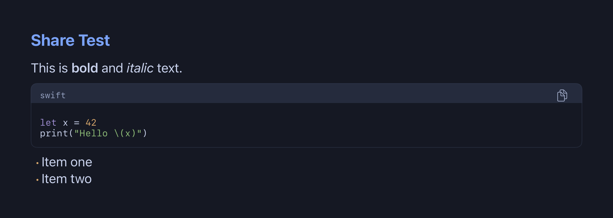

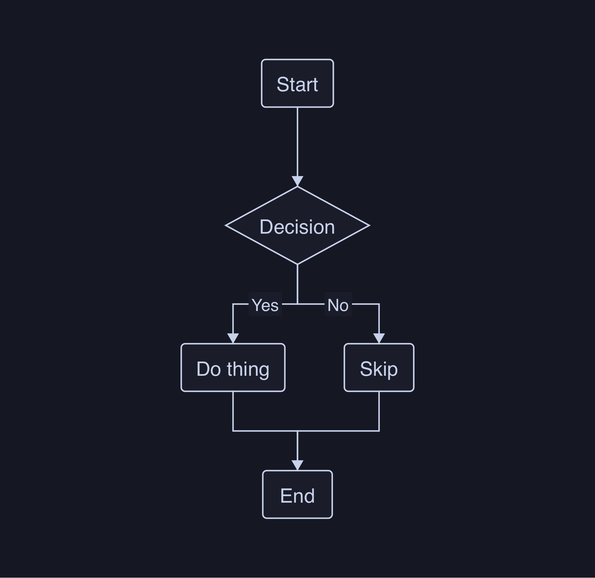

### Pipeline 2: HTML Template (Social Image Export)

For polished social-media-ready images, content flows through a completely different renderer:

```
Markdown
  → cmark-gfm (parse AST)
  → Walk nodes:
      mermaid/latex fences → CoreGraphics rasterize → base64 
      everything else → cmark_render_html()
  → Wrap in CSS template
  → Offscreen WKWebView
  → takeSnapshot() → [UIImage]
```

This pipeline solves the table problem by design: CSS `table-layout: fixed` with `word-wrap: break-word` forces text to wrap within the canvas width. Tables can never overflow.

## Export Gallery

### Simple Markdown

Clean typography with SF Pro, proper heading hierarchy, inline code styling.

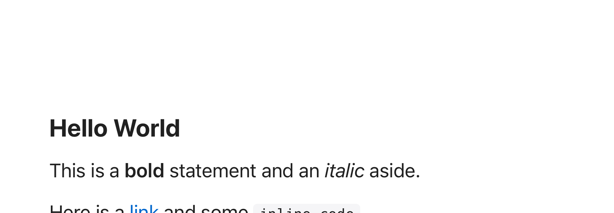

### Tables

`table-layout: fixed` distributes column widths equally and wraps text in cells. Alternating row stripes and header styling.

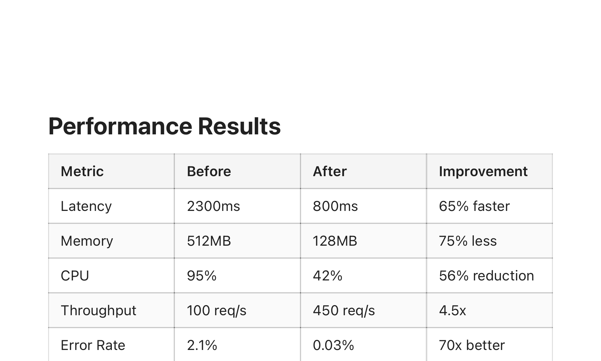

### Wide Tables (7+ columns)

This is where our approach differs from every other app. Instead of clipping, text wraps aggressively within each cell. The table always fits within the canvas width.

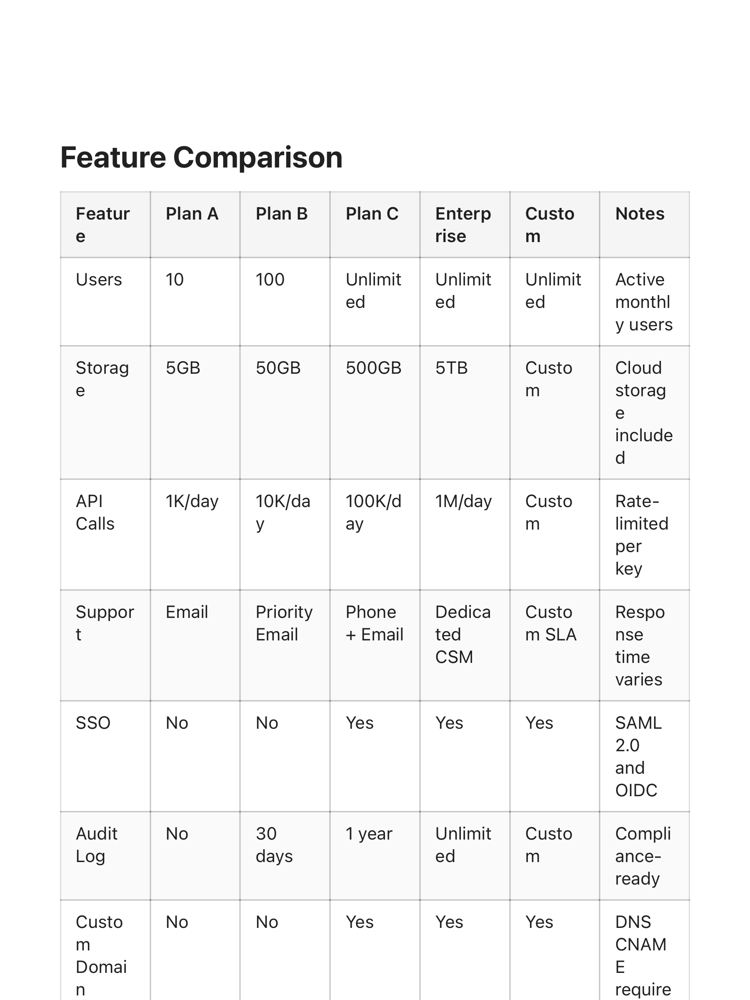

### Code Blocks

Monospace rendering with `pre-wrap` for long lines. Styled code container with subtle background.

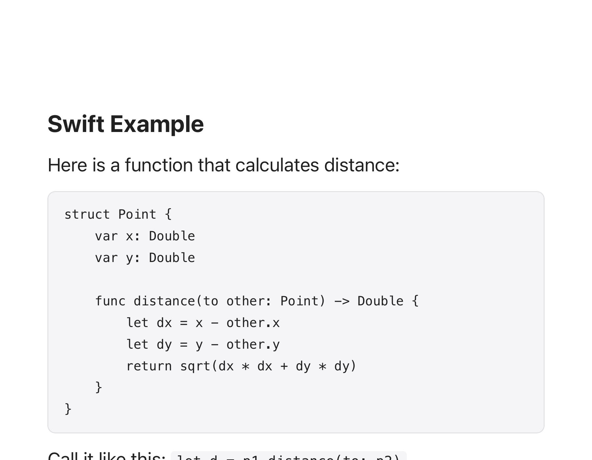

### Mermaid Diagrams

Mermaid code fences are rasterized via CoreGraphics (same `MermaidParser` + `MermaidFlowchartRenderer` used in the live chat) and embedded as base64 `` tags in the HTML template.

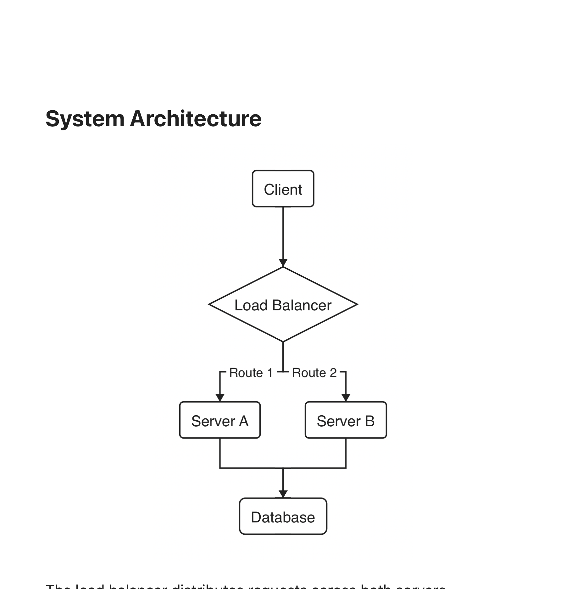

### LaTeX Expressions

Same pattern as mermaid -- rasterized via `MathCoreGraphicsRenderer` and embedded as base64 images.

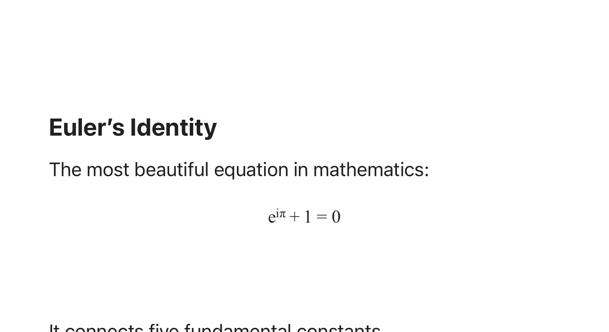

### Mixed Content

Tables, mermaid diagrams, code blocks, blockquotes -- all in one image. Each block type rendered with its own appropriate strategy.

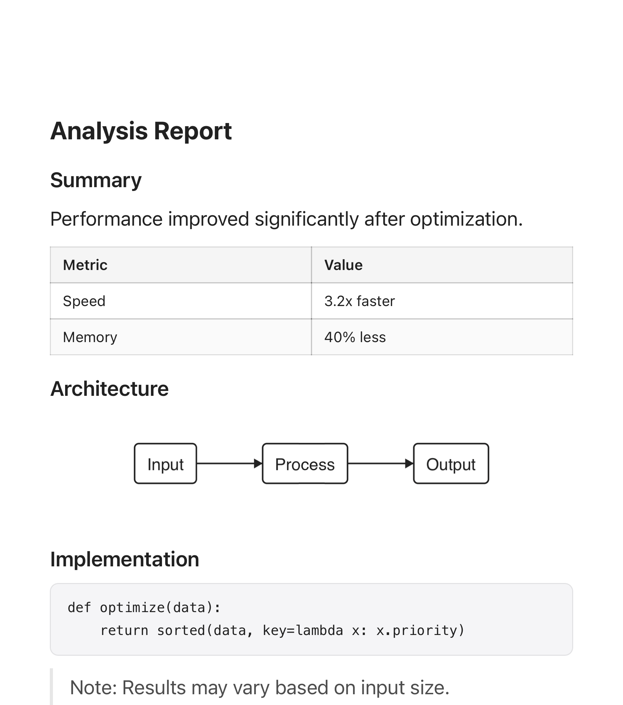

### Carousel (Long Content)

When content exceeds the preset's `maxHeight`, it splits into multiple images. Each page captures a slice of the rendered WKWebView.

**Page 1:**
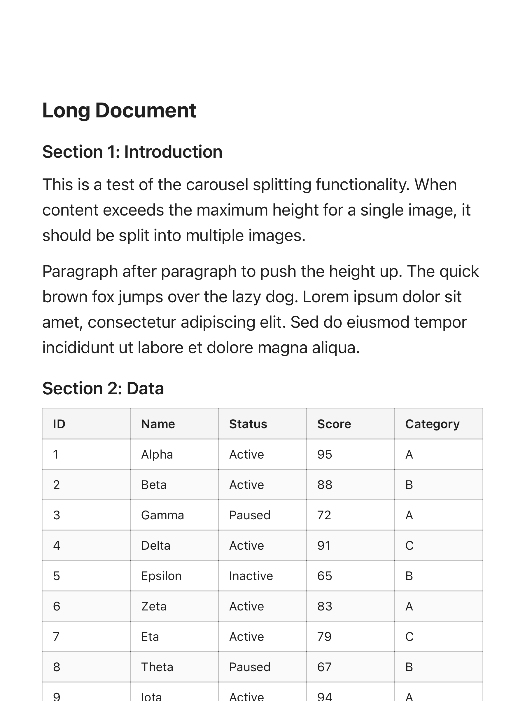

**Page 2:**
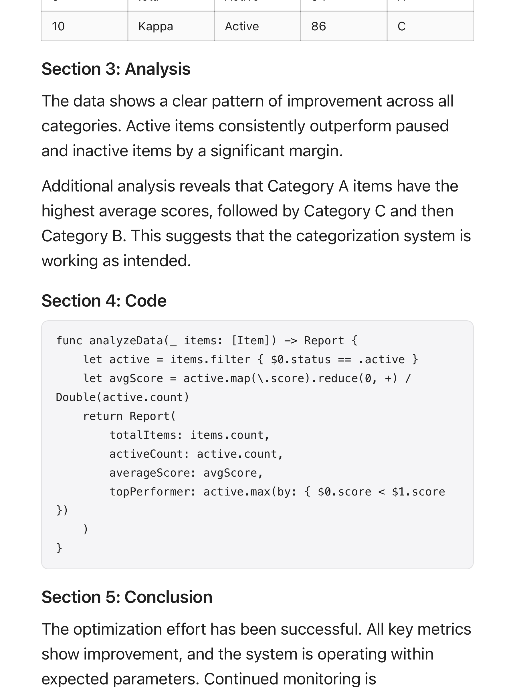

## Platform Presets

The renderer accepts presets tuned for specific social platforms:

| Platform | Canvas Width | Max Height | Max Images | Aspect |
|----------|-------------|------------|------------|--------|
| Generic | 600pt (1200px @2x) | 800pt | 20 | Free |
| X / Twitter | 600pt (1200px @2x) | 675pt | 4 | ~4:5 |
| Xiaohongshu | 540pt (1080px @2x) | 720pt | 9 | 3:4 |

Each preset constrains the canvas dimensions so exported images display optimally in the target platform's feed without cropping.

## Architecture

```
FileShareService (existing)
├── renderImage() → UIKit snapshot pipeline
│   └── AssistantMarkdownContentView (.export mode)
│       ├── Mermaid: applyAsDiagramSync
│       ├── Syntax: SyntaxHighlighter.highlight inline
│       └── Images: cache or alt text
├── renderPDF() → PDF renderers
└── renderSource() → temp file

SocialImageRenderer (new)
├── markdownToHTML() → cmark-gfm + base64 diagrams
├── wrapInTemplate() → CSS typography + table layout
└── renderHTMLToImages() → WKWebView → takeSnapshot
    └── renderCarousel() → split tall content
```

`FileShareService` handles the general export registry (format selection, PDF, source files). `SocialImageRenderer` is the specialized pipeline for social-media-optimized images where table wrapping, typography, and platform presets matter.

## Test Coverage

### SocialImageRenderer (19 tests)

- Simple markdown renders non-blank
- Code blocks have color variety (syntax elements)
- Tables render completely with visual structure
- Wide tables wrap to fit width (no overflow)
- Mermaid diagrams render as embedded images (5+ distinct colors)
- LaTeX renders as embedded images
- Mixed content renders all block types
- Carousel splits long content into multiple images
- Preset dimensions respected (generic, twitter)
- Dark theme pixel verification (background RGB < 80)
- Light theme pixel verification (background RGB > 200)
- HTML generation: table tags present, mermaid as base64, code blocks preserved
- HTML generation: lists, blockquotes
- Full artifact matrix with summary report

### ContentRenderingMode (covered by 45 existing tests)

- FlatSegment.build: mermaid detection, image resolution
- NativeMermaidBlockView: sync vs async rendering, export not blank
- NativeMarkdownImageView: loading states, cache behavior

### FileShareArtifacts (10 tests, 22 export paths)

- Full (content type x format) matrix with on-disk artifacts
- Image quality: blank detection for mermaid, latex, markdown, code
- PDF validity: header check, CGPDFDocument open, rasterize-not-blank
- Source round-trip: write/read/compare

All artifacts written to `.build/social-image-artifacts/` and `.build/share-artifacts/` for visual inspection after test runs.

## Key Design Decisions

1. **Two pipelines, not one.** The UIKit snapshot pipeline gives pixel-identical export of the live chat view. The HTML template pipeline gives control over typography, table layout, and platform sizing. Different tools for different jobs.

2. **Wrap first, never clip.** CSS `table-layout: fixed` forces text wrapping. Every other app clips wide tables. We don't.

3. **Rasterize diagrams, embed as base64.** Mermaid and LaTeX are rendered via the existing CoreGraphics pipeline (same code used in live chat) and embedded as `` tags. No JavaScript diagram libraries in the WKWebView. No network requests.

4. **Synchronous export mode.** `ContentRenderingMode.export` ensures the UIKit pipeline renders everything on the current thread before snapshotting. No race between async background rendering and `layer.render(in:)`.

5. **Client-side only.** Both pipelines run entirely on-device. No server round-trips. Export works offline.
